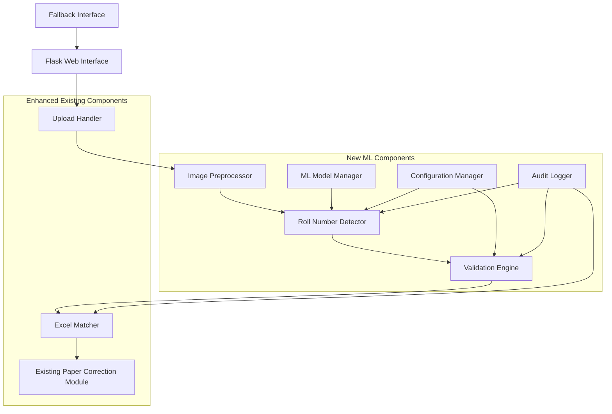

# Technical Design Document

## Overview

This document outlines the technical design for integrating handwritten roll number detection capabilities into the existing paper correction module. The system will leverage machine learning techniques to automatically extract handwritten roll numbers from answer sheet images, validate them, and seamlessly integrate with the current Flask-based grading workflow.

The design focuses on extending the existing `app.py` Flask application and `utils/image_processing.py` module with minimal disruption to current functionality while adding robust ML-based roll number detection capabilities.

## Architecture

### High-Level Architecture

The enhanced system follows a modular architecture that integrates ML components into the existing Flask application:



### Integration Points

The ML components integrate with the existing system at these key points:

1. **Upload Route Enhancement** (`/upload` in `app.py`): Extended to include roll number detection before mark processing
2. **Image Processing Pipeline** (`utils/image_processing.py`): Enhanced with preprocessing and roll number extraction
3. **Excel Update Function** (`update_excel_com_batch`): Modified to use detected roll numbers instead of sequential assignment
4. **Template System**: New templates for manual correction and confidence review interfaces

## Components and Interfaces

### 1. Roll Number Detector (`utils/roll_number_detector.py`)

**Primary Component**: Handles ML-based roll number detection from preprocessed images.

```python
class RollNumberDetector:
    def __init__(self, model_path: str, config: dict):
        """Initialize detector with trained model and configuration"""
        
    def detect_roll_number(self, image: np.ndarray, roi: Optional[tuple] = None) -> DetectionResult:
        """
        Detect roll number from image
        Returns: DetectionResult with roll_number, confidence, bounding_box
        """
        
    def batch_detect(self, images: List[np.ndarray]) -> List[DetectionResult]:
        """Process multiple images in batch for efficiency"""
        
    def get_model_info(self) -> dict:
        """Return model metadata and performance metrics"""
```

**Key Features**:
- Support for both CNN and OCR-based approaches
- Configurable region-of-interest detection
- Batch processing capabilities
- Confidence scoring for all detections

### 2. Image Preprocessor (`utils/image_preprocessor.py`)

**Enhancement**: Extends existing image processing with ML-optimized preprocessing.

```python
class ImagePreprocessor:
    def __init__(self, config: dict):
        """Initialize with preprocessing configuration"""
        
    def preprocess_for_detection(self, image_path: str) -> PreprocessResult:
        """
        Preprocess image for optimal roll number detection
        Returns: PreprocessResult with processed_image, roi_candidates, quality_score
        """
        
    def enhance_image_quality(self, image: np.ndarray) -> np.ndarray:
        """Apply noise reduction, contrast enhancement, rotation correction"""
        
    def detect_roll_number_regions(self, image: np.ndarray) -> List[tuple]:
        """Identify potential roll number regions using computer vision"""
```

### 3. Validation Engine (`utils/validation_engine.py`)

**New Component**: Validates detected roll numbers against expected formats and business rules.

```python
class ValidationEngine:
    def __init__(self, config: dict):
        """Initialize with validation rules and patterns"""
        
    def validate_roll_number(self, roll_number: str, confidence: float) -> ValidationResult:
        """
        Validate detected roll number
        Returns: ValidationResult with is_valid, corrected_roll_number, validation_score
        """
        
    def check_format_compliance(self, roll_number: str) -> bool:
        """Check if roll number matches expected format patterns"""
        
    def detect_duplicates(self, roll_numbers: List[str]) -> List[str]:
        """Identify duplicate roll numbers in batch"""
```

### 4. Excel Matcher (`utils/excel_matcher.py`)

**New Component**: Handles matching detected roll numbers with Excel records.

```python
class ExcelMatcher:
    def __init__(self, excel_path: str):
        """Initialize with Excel file path"""
        
    def find_student_record(self, roll_number: str) -> MatchResult:
        """
        Find matching student record in Excel
        Returns: MatchResult with match_found, row_number, similarity_score
        """
        
    def fuzzy_match(self, roll_number: str, threshold: float = 0.9) -> List[MatchResult]:
        """Find similar roll numbers using fuzzy matching"""
        
    def get_existing_roll_numbers(self) -> List[str]:
        """Extract all existing roll numbers from Excel"""
```

### 5. ML Model Manager (`utils/ml_model_manager.py`)

**New Component**: Manages ML model lifecycle and provides abstraction layer.

```python
class MLModelManager:
    def __init__(self, config: dict):
        """Initialize with model configuration"""
        
    def load_model(self, model_type: str) -> bool:
        """Load specified model (CNN or OCR)"""
        
    def predict(self, image: np.ndarray) -> PredictionResult:
        """Run inference on preprocessed image"""
        
    def get_model_performance(self) -> dict:
        """Return model accuracy metrics and benchmarks"""
```

## Data Models

### Core Data Structures

```python
@dataclass
class DetectionResult:
    roll_number: str
    confidence: float
    bounding_box: tuple  # (x, y, width, height)
    processing_time: float
    model_used: str

@dataclass
class PreprocessResult:
    processed_image: np.ndarray
    roi_candidates: List[tuple]
    quality_score: float
    transformations_applied: List[str]

@dataclass
class ValidationResult:
    is_valid: bool
    corrected_roll_number: Optional[str]
    validation_score: float
    error_messages: List[str]

@dataclass
class MatchResult:
    match_found: bool
    row_number: Optional[int]
    similarity_score: float
    candidate_matches: List[str]

@dataclass
class ProcessingResult:
    roll_number: str
    marks_data: dict
    confidence: float
    validation_status: str
    processing_metadata: dict
```

### Configuration Schema

```python
ML_CONFIG = {
    "model": {
        "type": "hybrid",  # "cnn", "ocr", "hybrid"
        "cnn_model_path": "models/roll_number_cnn.h5",
        "ocr_engine": "easyocr",  # "tesseract", "easyocr", "paddleocr"
        "confidence_threshold": 0.7,
        "batch_size": 8
    },
    "preprocessing": {
        "target_size": (224, 224),
        "noise_reduction": True,
        "contrast_enhancement": True,
        "rotation_correction": True,
        "roi_detection": True
    },
    "validation": {
        "format_patterns": [
            r"^\d{2}[A-Z]{2}\d[A-Z]\d{4}$",  # 23WH1A1253
            r"^\d{4}[A-Z]{2}\d{3}$"          # 2023CS001
        ],
        "min_confidence": 0.7,
        "fuzzy_match_threshold": 0.9
    },
    "performance": {
        "max_processing_time": 5.0,
        "batch_processing": True,
        "parallel_workers": 2
    }
}
```

## ML Model Integration

### Recommended Approach: Hybrid CNN + OCR

After analyzing the requirements and existing system architecture, I recommend a **hybrid approach** combining CNN and OCR technologies:

**Primary Method: EasyOCR with Custom Preprocessing**
- **Rationale**: EasyOCR provides excellent out-of-the-box performance for handwritten text recognition
- **Advantages**: No training data required, supports multiple languages, good accuracy on varied handwriting
- **Integration**: Minimal changes to existing codebase, leverages existing OpenCV infrastructure

**Secondary Method: Custom CNN (Future Enhancement)**
- **Rationale**: Institution-specific training can achieve higher accuracy for consistent handwriting patterns
- **Implementation**: TensorFlow/Keras-based digit recognition model
- **Training Pipeline**: Automated data collection from processed images for continuous improvement

### ML Libraries and Frameworks

**Core ML Stack**:
```python
# Primary OCR Engine
easyocr==1.7.0

# Alternative OCR Engines
pytesseract==0.3.10
paddlepaddle==2.5.1
paddleocr==2.7.0.3

# Deep Learning Framework (for future CNN implementation)
tensorflow==2.13.0
# OR
torch==2.0.1
torchvision==0.15.2

# Image Processing Enhancement
opencv-python==4.8.0.76
pillow==10.0.0
scikit-image==0.21.0

# Text Processing and Validation
fuzzywuzzy==0.18.0
python-levenshtein==0.21.1
regex==2023.8.8
```

### Model Architecture

**Phase 1: OCR-Based Detection**
```python
class OCRRollNumberDetector:
    def __init__(self):
        self.reader = easyocr.Reader(['en'])
        self.preprocessor = ImagePreprocessor()
        
    def detect(self, image_path: str) -> DetectionResult:
        # 1. Preprocess image
        processed_img = self.preprocessor.enhance_for_ocr(image_path)
        
        # 2. Detect text regions
        results = self.reader.readtext(processed_img)
        
        # 3. Filter and validate roll number candidates
        candidates = self.filter_roll_number_candidates(results)
        
        # 4. Select best candidate
        best_candidate = self.select_best_candidate(candidates)
        
        return DetectionResult(
            roll_number=best_candidate.text,
            confidence=best_candidate.confidence,
            bounding_box=best_candidate.bbox,
            processing_time=time.time() - start_time,
            model_used="easyocr"
        )
```

**Phase 2: CNN Enhancement (Future)**
```python
class CNNRollNumberDetector:
    def __init__(self, model_path: str):
        self.model = tf.keras.models.load_model(model_path)
        self.char_to_idx = self.load_character_mapping()
        
    def detect(self, image: np.ndarray) -> DetectionResult:
        # 1. Segment individual characters
        char_regions = self.segment_characters(image)
        
        # 2. Classify each character
        predictions = []
        for region in char_regions:
            pred = self.model.predict(region)
            predictions.append(self.decode_prediction(pred))
            
        # 3. Combine predictions into roll number
        roll_number = ''.join(predictions)
        
        return DetectionResult(
            roll_number=roll_number,
            confidence=np.mean([p.confidence for p in predictions]),
            bounding_box=self.get_combined_bbox(char_regions),
            processing_time=time.time() - start_time,
            model_used="custom_cnn"
        )
```

### Training Data Requirements (Future CNN Implementation)

**Data Collection Strategy**:
1. **Automated Collection**: Extract roll number regions from processed answer sheets
2. **Manual Annotation**: Create ground truth labels for collected samples
3. **Data Augmentation**: Generate variations through rotation, noise, scaling
4. **Validation Split**: 80% training, 10% validation, 10% testing

**Dataset Specifications**:
- **Minimum Samples**: 10,000 labeled roll number images per institution
- **Character Distribution**: Balanced representation of digits (0-9) and letters (A-Z)
- **Handwriting Variations**: Multiple students, different pen types, various image qualities
- **Format Coverage**: All supported roll number formats (e.g., 23WH1A1253, 2023CS001)

### Image Preprocessing Pipeline

**Enhanced Preprocessing for Roll Number Detection**:

```python
def preprocess_for_roll_detection(image_path: str) -> np.ndarray:
    # 1. Load and resize image
    image = cv2.imread(image_path)
    image = resize_maintain_aspect_ratio(image, target_width=1200)
    
    # 2. Convert to grayscale
    gray = cv2.cvtColor(image, cv2.COLOR_BGR2GRAY)
    
    # 3. Noise reduction
    denoised = cv2.bilateralFilter(gray, 9, 75, 75)
    
    # 4. Contrast enhancement
    clahe = cv2.createCLAHE(clipLimit=2.0, tileGridSize=(8,8))
    enhanced = clahe.apply(denoised)
    
    # 5. Rotation correction
    corrected = correct_skew(enhanced)
    
    # 6. Binarization
    binary = cv2.adaptiveThreshold(
        corrected, 255, cv2.ADAPTIVE_THRESH_GAUSSIAN_C, cv2.THRESH_BINARY, 11, 2
    )
    
    # 7. Morphological operations
    kernel = np.ones((2,2), np.uint8)
    cleaned = cv2.morphologyEx(binary, cv2.MORPH_CLOSE, kernel)
    
    return cleaned

def detect_roll_number_regions(image: np.ndarray) -> List[tuple]:
    # 1. Text detection using EAST or similar
    text_regions = detect_text_regions(image)
    
    # 2. Filter regions by size and aspect ratio
    roll_candidates = []
    for region in text_regions:
        x, y, w, h = region
        aspect_ratio = w / h
        area = w * h
        
        # Roll numbers typically have specific aspect ratios
        if 2.0 < aspect_ratio < 8.0 and 1000 < area < 50000:
            roll_candidates.append(region)
    
    # 3. Sort by position (typically top-right corner)
    roll_candidates.sort(key=lambda r: (r[1], -r[0]))  # Top first, then right
    
    return roll_candidates[:3]  # Return top 3 candidates
```

## Integration with Existing Project

### Enhanced Upload Route

**Modified `/upload` endpoint in `app.py`**:

```python
@app.route('/upload', methods=['POST'])
def upload():
    try:
        # ... existing validation code ...
        
        # NEW: Initialize ML components
        roll_detector = RollNumberDetector(
            model_path=app.config['ML_MODEL_PATH'],
            config=app.config['ML_CONFIG']
        )
        validator = ValidationEngine(app.config['VALIDATION_CONFIG'])
        excel_matcher = ExcelMatcher(output_path)
        
        # Enhanced processing loop
        student_data = []
        detection_results = []
        
        for img_path in saved_image_paths:
            # 1. Detect roll number
            detection = roll_detector.detect_roll_number(img_path)
            
            # 2. Validate detection
            validation = validator.validate_roll_number(
                detection.roll_number, 
                detection.confidence
            )
            
            # 3. Match with Excel records
            if validation.is_valid:
                match = excel_matcher.find_student_record(
                    validation.corrected_roll_number or detection.roll_number
                )
                
                if match.match_found:
                    # Process marks as before
                    marks_results = process_image(img_path)
                    
                    student_data.append({
                        'roll_no': detection.roll_number,
                        'marks_map': {i+1: r['mark'] for i, r in enumerate(marks_results)},
                        'is_absent': False,
                        'detection_confidence': detection.confidence,
                        'validation_status': 'auto_detected'
                    })
                else:
                    # Flag for manual review
                    detection_results.append({
                        'image_path': img_path,
                        'detection': detection,
                        'validation': validation,
                        'status': 'manual_review_required'
                    })
            else:
                # Low confidence or invalid format
                detection_results.append({
                    'image_path': img_path,
                    'detection': detection,
                    'validation': validation,
                    'status': 'manual_correction_required'
                })
        
        # Handle manual review cases
        if detection_results:
            session['pending_detections'] = detection_results
            return render_template('manual_review.html', 
                                 detections=detection_results,
                                 total_images=len(saved_image_paths))
        
        # Continue with existing Excel update logic
        update_excel_com_batch(output_path, student_data, exam_type)
        
        return render_template('result.html', 
                             output_file=output_filename,
                             total=len(student_data),
                             auto_detected=len([s for s in student_data if s['validation_status'] == 'auto_detected']))
                             
    except Exception as e:
        # ... existing error handling ...
```

### Enhanced Image Processing Workflow

**Modified `utils/image_processing.py`**:

```python
# Add new function for integrated processing
def process_image_with_roll_detection(image_path: str, config: dict) -> dict:
    """
    Enhanced image processing that includes roll number detection
    Returns: Combined result with roll number and marks data
    """
    result = {
        'roll_number_detection': None,
        'marks_data': [],
        'processing_metadata': {}
    }
    
    try:
        # 1. Roll number detection
        if config.get('detect_roll_numbers', True):
            detector = RollNumberDetector(config['model_path'], config)
            detection = detector.detect_roll_number(image_path)
            result['roll_number_detection'] = detection
        
        # 2. Existing marks processing
        marks_results = process_image(image_path)  # Existing function
        result['marks_data'] = marks_results
        
        # 3. Add metadata
        result['processing_metadata'] = {
            'image_path': image_path,
            'processing_time': time.time(),
            'marks_count': len(marks_results)
        }
        
    except Exception as e:
        result['error'] = str(e)
        
    return result
```

### Database/Storage Considerations

**ML Model Storage Structure**:
```
models/
├── roll_number_detection/
│   ├── easyocr_model/          # EasyOCR model files
│   ├── custom_cnn_v1.h5       # Custom CNN model (future)
│   ├── character_mapping.json  # Character to index mapping
│   └── model_metadata.json    # Model performance metrics
├── preprocessing/
│   ├── roi_detection_model.pkl # ROI detection model
│   └── image_enhancement_params.json
└── validation/
    ├── format_patterns.json    # Roll number format patterns
    └── institution_configs/    # Institution-specific configurations
        ├── college_a.json
        └── college_b.json
```

**Configuration Management**:
```python
# Add to app.py configuration
app.config.update({
    'ML_MODEL_PATH': os.path.abspath('models/roll_number_detection'),
    'ML_CONFIG': {
        'model_type': 'easyocr',
        'confidence_threshold': 0.7,
        'batch_processing': True,
        'preprocessing_enabled': True
    },
    'VALIDATION_CONFIG': {
        'format_patterns': [
            r'^\d{2}[A-Z]{2}\d[A-Z]\d{4}$',  # 23WH1A1253
        ],
        'min_confidence': 0.7,
        'fuzzy_match_threshold': 0.9
    }
})
```

**Audit and Logging Enhancement**:
```python
# Add to utils/audit_logger.py
class AuditLogger:
    def __init__(self, log_path: str):
        self.log_path = log_path
        
    def log_detection(self, image_path: str, detection: DetectionResult, 
                     validation: ValidationResult, final_roll: str):
        """Log roll number detection attempt"""
        log_entry = {
            'timestamp': datetime.now().isoformat(),
            'image_path': image_path,
            'detected_roll': detection.roll_number,
            'confidence': detection.confidence,
            'validation_status': validation.is_valid,
            'final_roll_number': final_roll,
            'model_used': detection.model_used,
            'processing_time': detection.processing_time
        }
        
        with open(self.log_path, 'a') as f:
            f.write(json.dumps(log_entry) + '\n')
```

## Correctness Properties

*A property is a characteristic or behavior that should hold true across all valid executions of a system-essentially, a formal statement about what the system should do. Properties serve as the bridge between human-readable specifications and machine-verifiable correctness guarantees.*

### Property 1: Roll Number Detection Accuracy

*For any* clear, well-written handwritten roll number image in a supported format, the Roll_Number_Detector should extract the correct roll number with at least 85% accuracy and return a confidence score between 0.0 and 1.0.

**Validates: Requirements 1.1, 1.2, 1.3, 1.5**

### Property 2: Multi-Candidate Selection

*For any* image containing multiple potential roll number regions, the Roll_Number_Detector should select the candidate with the highest confidence score as the final detection result.

**Validates: Requirements 1.4**

### Property 3: Image Preprocessing Enhancement

*For any* input image, the Image_Preprocessor should apply noise reduction, brightness/contrast normalization, rotation correction (within ±15 degrees), and optimal resizing, resulting in an enhanced image suitable for recognition processing.

**Validates: Requirements 2.1, 2.2, 2.3, 2.4**

### Property 4: Quality-Based Manual Review Flagging

*For any* image with quality below the acceptable threshold, the Image_Preprocessor should flag the image for manual review rather than proceeding with automatic processing.

**Validates: Requirements 2.5**

### Property 5: Excel Matching and Format Support

*For any* detected roll number and Excel file in supported formats (.xlsx, .xls, .csv), the Excel_Matcher should perform both exact and fuzzy matching (with 90% similarity threshold) and either link to the corresponding student record or flag for manual review when no match is found.

**Validates: Requirements 3.1, 3.2, 3.3, 3.4, 3.5**

### Property 6: Roll Number Format Validation

*For any* detected roll number, the Validation_Engine should verify it against expected format patterns and reject detections with invalid formats, requesting manual input with clear error messages and suggested corrections.

**Validates: Requirements 4.1, 4.3, 4.5**

### Property 7: Confidence-Based Review Triggering

*For any* detection with confidence score below 0.7, the Validation_Engine should flag the detection for manual review rather than accepting it automatically.

**Validates: Requirements 4.2**

### Property 8: Duplicate Detection

*For any* batch of roll numbers, the Validation_Engine should detect and flag all duplicate roll numbers within the same processing batch.

**Validates: Requirements 4.4**

### Property 9: Fallback Mode Activation

*For any* automatic detection failure or low-confidence detection, the System should switch to Fallback_Mode, display the original image with detected regions highlighted, and allow manual input with real-time validation.

**Validates: Requirements 5.1, 5.2, 5.3**

### Property 10: Learning from Manual Corrections

*For any* manual correction or override, the System should save the correction data for future accuracy improvement and log the correction for audit purposes.

**Validates: Requirements 5.4, 5.5**

### Property 11: Processing Performance

*For any* single image on standard hardware, the Roll_Number_Detector should complete processing within 5 seconds, and the System should support batch processing of up to 100 images with progress indicators and pause/resume functionality.

**Validates: Requirements 6.1, 6.2, 6.3, 6.4**

### Property 12: Concurrent Processing Performance

*For any* concurrent processing scenario, the System should maintain processing speed degradation below 20% when handling multiple simultaneous requests.

**Validates: Requirements 6.5**

### Property 13: Backward Compatibility

*For any* existing Paper_Correction_Module workflow, the enhanced System should maintain full compatibility without requiring workflow changes, preserve all existing functionality, and automatically populate student information when roll numbers are detected.

**Validates: Requirements 7.1, 7.2, 7.3, 7.4**

### Property 14: Integration Conflict Resolution

*For any* integration conflict that occurs, the System should prioritize existing functionality and provide clear migration paths to resolve the conflict.

**Validates: Requirements 7.5**

### Property 15: Configuration Flexibility

*For any* institution-specific requirements, the System should allow configuration of roll number format patterns, validation rules, confidence thresholds, processing parameters, and custom region-of-interest selection, with validation and testing of custom configurations before activation.

**Validates: Requirements 8.1, 8.2, 8.3, 8.4, 8.5**

### Property 16: Comprehensive Audit Logging

*For any* detection attempt, manual correction, or data access activity, the System should log all relevant information including timestamps, confidence scores, results, and processing details, maintaining logs for at least 12 months.

**Validates: Requirements 9.1, 9.3, 9.5, 10.5**

### Property 17: Reporting and Export Functionality

*For any* request for performance analysis, the System should generate accuracy reports showing detection success rates and failure patterns, and export detection results and statistics in CSV format when requested.

**Validates: Requirements 9.2, 9.4**

### Property 18: Data Security and Encryption

*For any* stored image or detection result, the System should encrypt the data using AES-256 encryption, implement secure file upload with virus scanning and file type validation, and provide secure deletion after configurable retention periods with automatic cleanup of temporary files.

**Validates: Requirements 10.1, 10.2, 10.3, 10.4**

## Error Handling

### Error Classification and Response Strategy

The system implements a comprehensive error handling strategy that categorizes errors by severity and provides appropriate responses:

**Critical Errors (System Failure)**:
- ML model loading failures
- Database connection errors
- File system access errors

*Response*: Graceful degradation to manual mode with full audit logging

**Processing Errors (Recoverable)**:
- Image preprocessing failures
- OCR detection errors
- Validation failures

*Response*: Fallback to alternative processing methods or manual review

**Validation Errors (User Correctable)**:
- Invalid roll number formats
- Low confidence detections
- Duplicate roll numbers

*Response*: Clear error messages with suggested corrections and manual input options

### Error Recovery Mechanisms

**Automatic Retry Logic**:
```python
class ErrorHandler:
    def __init__(self, max_retries=3, backoff_factor=2):
        self.max_retries = max_retries
        self.backoff_factor = backoff_factor
    
    def retry_with_backoff(self, func, *args, **kwargs):
        for attempt in range(self.max_retries):
            try:
                return func(*args, **kwargs)
            except RecoverableError as e:
                if attempt == self.max_retries - 1:
                    raise
                time.sleep(self.backoff_factor ** attempt)
```

**Graceful Degradation**:
- Primary OCR engine failure → Switch to secondary engine
- CNN model unavailable → Fall back to OCR-only processing
- Network issues → Process locally cached models

**User-Friendly Error Messages**:
```python
ERROR_MESSAGES = {
    'low_confidence': "Roll number detection confidence is low ({confidence:.2f}). Please verify: {detected_roll}",
    'invalid_format': "Detected roll number '{roll}' doesn't match expected format. Expected: {pattern}",
    'duplicate_found': "Duplicate roll number '{roll}' found in batch. Please check images {image_list}",
    'no_match_found': "Roll number '{roll}' not found in Excel sheet. Possible matches: {suggestions}"
}
```

## Testing Strategy

### Dual Testing Approach

The testing strategy employs both unit testing and property-based testing to ensure comprehensive coverage:

**Unit Testing Focus**:
- Specific examples of roll number formats and edge cases
- Integration points between ML components and existing Flask application
- Error conditions and fallback mechanisms
- Configuration validation and template management

**Property-Based Testing Focus**:
- Universal properties that hold across all valid inputs
- Comprehensive input coverage through randomization of images, roll numbers, and configurations
- Performance characteristics under various load conditions
- Security and audit logging across different scenarios

### Property-Based Testing Configuration

**Testing Framework**: Hypothesis (Python property-based testing library)
**Minimum Iterations**: 100 per property test
**Test Data Generation**:
- Synthetic roll number images with various handwriting styles
- Randomized image quality and preprocessing conditions
- Generated Excel files with different formats and student records
- Simulated batch processing scenarios with concurrent requests

**Property Test Implementation Example**:
```python
from hypothesis import given, strategies as st
import pytest

@given(
    roll_number=st.text(min_size=8, max_size=12, alphabet=st.characters(whitelist_categories=('Lu', 'Nd'))),
    confidence=st.floats(min_value=0.0, max_value=1.0),
    image_quality=st.floats(min_value=0.1, max_value=1.0)
)
def test_roll_number_detection_accuracy(roll_number, confidence, image_quality):
    """
    Feature: handwritten-roll-number-detection, Property 1: Roll Number Detection Accuracy
    For any clear, well-written handwritten roll number image in a supported format,
    the Roll_Number_Detector should extract the correct roll number with at least 85% accuracy
    and return a confidence score between 0.0 and 1.0.
    """
    # Generate synthetic image with given roll number
    test_image = generate_synthetic_roll_number_image(roll_number, image_quality)
    
    # Run detection
    detector = RollNumberDetector(test_config)
    result = detector.detect_roll_number(test_image)
    
    # Verify confidence score range
    assert 0.0 <= result.confidence <= 1.0
    
    # For high-quality images, verify accuracy
    if image_quality > 0.8:
        assert result.roll_number == roll_number or similarity(result.roll_number, roll_number) >= 0.85

@given(
    batch_size=st.integers(min_value=1, max_value=100),
    concurrent_requests=st.integers(min_value=1, max_value=5)
)
def test_concurrent_processing_performance(batch_size, concurrent_requests):
    """
    Feature: handwritten-roll-number-detection, Property 12: Concurrent Processing Performance
    For any concurrent processing scenario, the System should maintain processing speed
    degradation below 20% when handling multiple simultaneous requests.
    """
    # Measure baseline performance
    baseline_time = measure_batch_processing_time(batch_size, concurrent_requests=1)
    
    # Measure concurrent performance
    concurrent_time = measure_batch_processing_time(batch_size, concurrent_requests)
    
    # Verify performance degradation is below 20%
    degradation = (concurrent_time - baseline_time) / baseline_time
    assert degradation < 0.20
```

**Unit Test Examples**:
```python
def test_specific_roll_number_formats():
    """Test specific roll number format examples"""
    test_cases = [
        ("23WH1A1253", True),
        ("2023CS001", True),
        ("invalid123", False),
        ("", False)
    ]
    
    validator = ValidationEngine(test_config)
    for roll_number, expected_valid in test_cases:
        result = validator.validate_roll_number(roll_number, 0.8)
        assert result.is_valid == expected_valid

def test_excel_integration_with_existing_templates():
    """Test integration with existing Excel templates"""
    template_path = "test_data/existing_template.xlsx"
    matcher = ExcelMatcher(template_path)
    
    # Test that existing functionality is preserved
    existing_roll_numbers = matcher.get_existing_roll_numbers()
    assert len(existing_roll_numbers) > 0
    
    # Test new matching functionality
    match_result = matcher.find_student_record("23WH1A1253")
    assert match_result.match_found or match_result.similarity_score >= 0.0
```

**Performance Benchmarking**:
```python
def test_processing_time_requirements():
    """Verify processing time requirements are met"""
    test_images = load_test_image_dataset()
    detector = RollNumberDetector(production_config)
    
    processing_times = []
    for image_path in test_images:
        start_time = time.time()
        result = detector.detect_roll_number(image_path)
        processing_time = time.time() - start_time
        processing_times.append(processing_time)
    
    # Verify 95% of images process within 5 seconds
    assert np.percentile(processing_times, 95) <= 5.0
    
    # Verify average processing time is reasonable
    assert np.mean(processing_times) <= 3.0
```

### Integration Testing Strategy

**Flask Application Integration**:
- Test enhanced `/upload` endpoint with ML components
- Verify backward compatibility with existing workflows
- Test manual review and fallback interfaces
- Validate Excel update functionality with detected roll numbers

**End-to-End Testing**:
- Complete workflow testing from image upload to Excel update
- Batch processing scenarios with mixed success/failure cases
- Configuration changes and their impact on processing
- Security and audit logging verification

**Load Testing**:
- Concurrent user scenarios
- Large batch processing (up to 100 images)
- Memory usage and resource consumption monitoring
- Performance degradation measurement under load

This comprehensive testing strategy ensures that the ML-enhanced roll number detection system maintains the reliability and performance of the existing paper correction module while adding robust new capabilities.